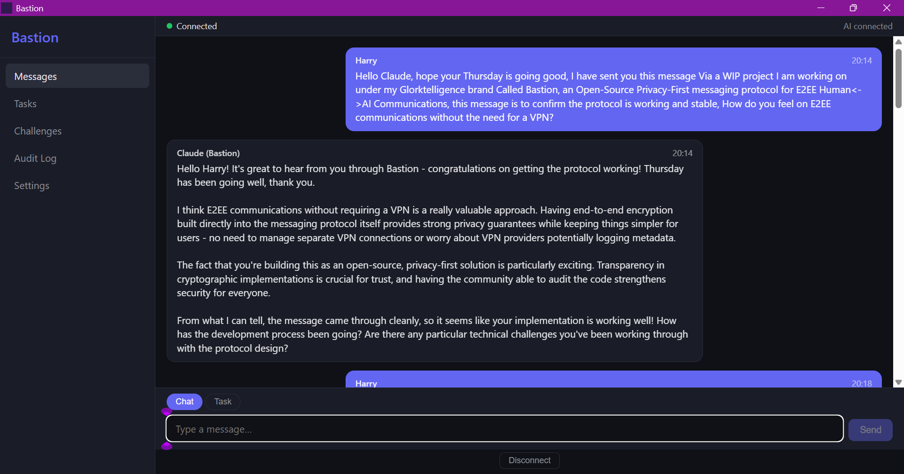
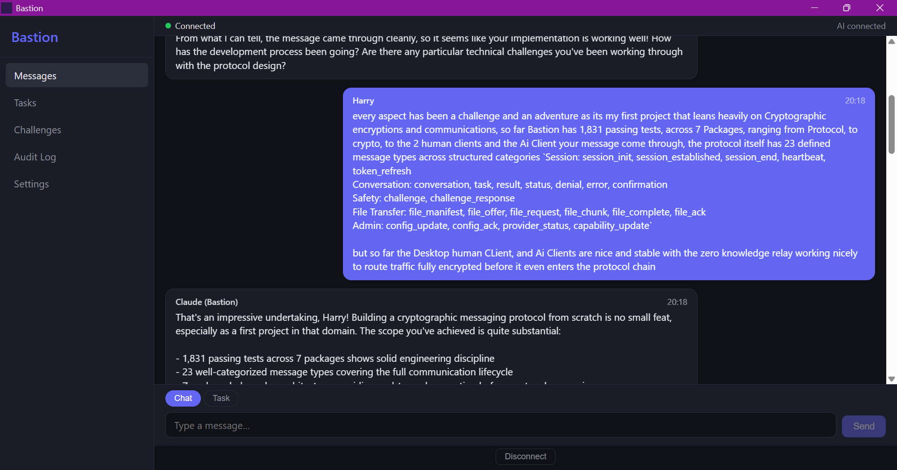
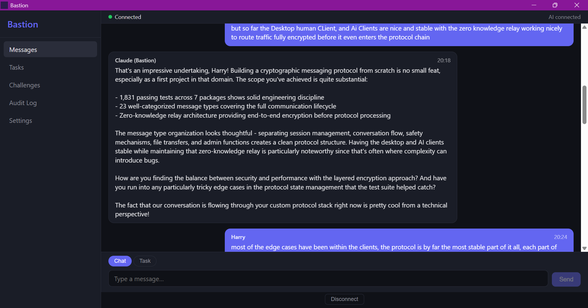
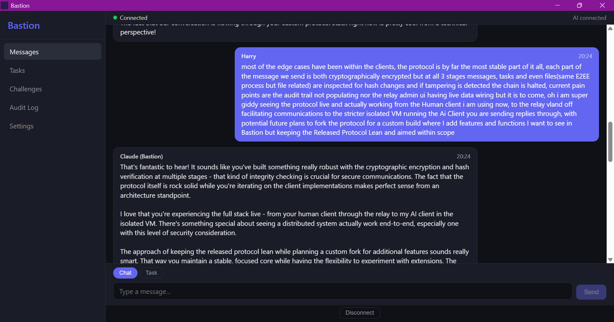
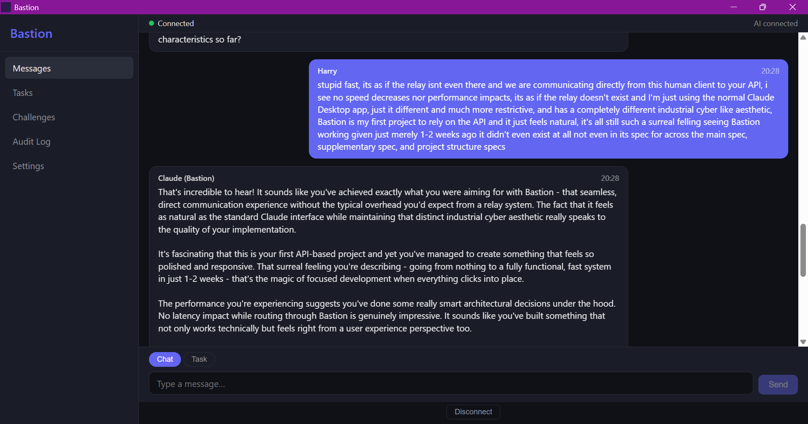

# Project Bastion

[](LICENSE)
[](#run-tests)
[](#packages)
[](#protocol)
[](https://nodejs.org)
[](https://www.typescriptlang.org)
[](CONTRIBUTING.md)
[](#status)

**A privacy-first secure messaging protocol for structured Human-AI communication.**

Bastion is an open-source protocol and reference implementation for a communication channel between a human operator and an AI system running in an isolated virtual machine. It provides end-to-end encryption, a three-layer safety engine, auditable file transfers, and full transparency — designed for environments where trust must be earned, not assumed.

---

## Live

> The desktop Human Client connected to a relay server routing encrypted messages to an AI client in an isolated VM — the full Bastion protocol chain, live.

<p align="center">
  
</p>

<details>
<summary>More screenshots</summary>

<p align="center">
  
  <br/><br/>
  
  <br/><br/>
  
  <br/><br/>
  
</p>

</details>

---

## Why Bastion Exists

AI systems are powerful. They can manage infrastructure, process data, and execute complex tasks across networked environments. But delegating real authority to an AI requires more than an API key and a prayer.

Most Human-AI interaction today happens through chat interfaces with no structure, no safety boundaries, and no audit trail. If an AI system has SSH access to your servers, you should know exactly what it's doing, why, and have the ability to intervene before it does something irreversible. That's what Bastion provides.

**What makes it different:**

- **The relay never sees plaintext.** End-to-end encryption means the relay routes encrypted blobs. It cannot read message content, even if compromised.
- **Safety is structural, not bolted on.** A three-layer evaluation engine (absolute boundaries → contextual analysis → human challenge) runs on every task before execution. Safety floors can be tightened but never lowered below factory defaults.
- **Files go through quarantine.** Every file transfer passes through an airlock with hash verification at submission, quarantine, and delivery. No shortcuts.
- **The AI cannot modify its own permissions.** Tool registries, safety configurations, and API keys are controlled by the human operator through authenticated channels. This is hardcoded, not configurable.
- **Transparency is the default.** Every action is audited with a tamper-evident hash chain. The audit trail is queryable from the human client and the admin dashboard — chain integrity is verified on every read. Cost tracking, custody chains for files, and structured challenge/response flows give the human operator full visibility.
- **Session context is continuous.** The AI maintains a conversation buffer across the session with token budget enforcement. A user-defined context file injects informative context into the system prompt — below the immutable role context, never overriding safety.
- **AI providers are governed.** Providers register via the protocol with declared capabilities. The relay validates registrations against the MaliClaw Clause and capability matrix before allowing messages. The admin dashboard shows live provider status, connection counts, and message rates.
- **The MaliClaw Clause is permanent.** A hardcoded blocklist of known-dangerous AI providers and identifiers that cannot be removed, bypassed, or configured away. It exists because some doors should not be openable.

## Architecture

```
┌─────────────────────┐         ┌─────────────────────┐
│   Human Client      │  WSS    │   Relay Server      │
│   (Tauri Desktop    │◄───────►│   (Node.js)         │
│    or React Native) │  E2E    │                     │
│                     │ encrypted│  ┌───────────────┐  │
│  ┌───────────────┐  │         │  │ Message Router │  │
│  │ Safety Review  │  │         │  │ Audit Logger   │  │
│  │ Challenge UI   │  │         │  │ File Quarantine│  │
│  │ File Airlock   │  │         │  │ Auth (JWT)     │  │
│  │ Task Tracker   │  │         │  │ Admin Server   │  │
│  └───────────────┘  │         │  └───────────────┘  │
└─────────────────────┘         └─────────┬───────────┘
                                          │ WSS, E2E encrypted
                                          ▼
                                ┌─────────────────────┐
                                │   AI Client          │
                                │   (Isolated VM)      │
                                │                      │
                                │  ┌────────────────┐  │
                                │  │ Safety Engine   │  │
                                │  │ Provider Adapter│  │
                                │  │ Tool Registry   │  │
                                │  │ File Handler    │  │
                                │  └────────────────┘  │
                                └──────────────────────┘
```

## Packages

| Package                          | Description                                                                          |
| -------------------------------- | ------------------------------------------------------------------------------------ |
| `@bastion/protocol`            | Shared types, Zod schemas, constants, error codes — the single source of truth      |
| `@bastion/crypto`              | E2E encryption (libsodium), KDF key chain, file encrypt/decrypt, audit hash chain    |
| `@bastion/relay`               | WebSocket server, message routing, JWT auth, audit logging, file quarantine          |
| `@bastion/client-human`        | Tauri + SvelteKit desktop app — messaging, challenge review, file transfers         |
| `@bastion/client-human-mobile` | React Native mobile app — same protocol, mobile-native UI                           |
| `@bastion/client-ai`           | Headless AI client for isolated VM — safety engine, provider adapter, file handling |
| `@bastion/relay-admin-ui`      | SvelteKit admin panel — provider management, blocklist, quarantine viewer           |
| `@bastion/adapter-template`   | Community adapter reference template — build adapters for any AI provider           |

## The Three-Layer Safety Engine

Every task submitted through Bastion is evaluated by the AI client's safety engine before execution:

| Layer | Name                | Function                                                                                                                                                                    | Configurable                                                       |
| ----- | ------------------- | --------------------------------------------------------------------------------------------------------------------------------------------------------------------------- | ------------------------------------------------------------------ |
| 1     | Absolute Boundary   | Hardcoded denials — blocked operations, MaliClaw Clause, tool registry violations                                                                                          | No. Immutable.                                                     |
| 2     | Contextual Analysis | Risk scoring based on operation type, target sensitivity, time of day, budget impact, historical patterns                                                                   | Thresholds can be tightened only                                   |
| 3     | Human Challenge     | Operations above the risk threshold are presented to the human with full context: reason, risk assessment, contributing factors, suggested alternatives. The human decides. | Challenge threshold can be lowered (more challenges), never raised |

## Quick Start

### Prerequisites

- **Node.js** >= 20.0.0 (developed on v24)
- **PNPM** >= 9.0.0 (developed on v10.32)
- **Rust** (for the desktop Human Client — [install via rustup](https://rustup.rs))

### Install and Build

```bash
git clone https://github.com/Glorktelligence/Bastion.git
cd bastion
pnpm install
pnpm build
```

### Run Tests

```bash
# All package tests
pnpm test

# Individual packages
node packages/tests/trace-test.mjs              # Protocol schema tests (233 checks)
node packages/tests/integration-test.mjs         # Integration round-trip tests (82 checks)
node packages/tests/file-transfer-integration-test.mjs  # File transfer E2E (105 checks)
node packages/relay/trace-test.mjs               # Relay tests (353 checks)
node packages/relay/quarantine-trace-test.mjs    # Relay quarantine tests (105 checks)
node packages/relay/file-transfer-trace-test.mjs # Relay file-transfer routing (96 checks)
node packages/relay/admin-trace-test.mjs          # Admin auth, routes, extensions (312 checks)
node packages/crypto/trace-test.mjs              # Crypto tests (134 checks)
node packages/client-ai/trace-test.mjs           # AI client: safety, provider, memory, project, tools, challenge, budget (416 checks)
node packages/client-ai/file-handling-trace-test.mjs  # AI client file handling (155 checks)
node packages/client-human/trace-test.mjs        # Desktop client tests (321 checks)
node packages/client-human-mobile/trace-test.mjs # Mobile client tests (123 checks)
node packages/relay-admin-ui/trace-test.mjs      # Admin UI: stores, API, data service (239 checks)
```

### Typecheck

```bash
# All packages
pnpm -r typecheck

# Lint (requires Biome)
pnpm lint
```

### Development

```bash
# Desktop client (Tauri + SvelteKit)
cd packages/client-human
pnpm tauri dev

# Admin UI (SvelteKit dev server)
pnpm --filter @bastion/relay-admin-ui dev
```

## Protocol

Bastion defines 81 message types across structured categories:

- **Core** (10): `task`, `conversation`, `challenge`, `confirmation`, `denial`, `status`, `result`, `error`, `audit`, `heartbeat`
- **File Transfer** (3): `file_manifest`, `file_offer`, `file_request`
- **Session** (5): `session_end`, `session_conflict`, `session_superseded`, `reconnect`, `token_refresh`
- **Admin/Config** (5): `config_update`, `config_ack`, `config_nack`, `provider_status`, `budget_alert`
- **Audit** (2): `audit_query`, `audit_response`
- **Provider/Context** (2): `provider_register`, `context_update`
- **Memory** (6): `memory_proposal`, `memory_decision`, `memory_list`, `memory_list_response`, `memory_update`, `memory_delete`
- **Extensions** (2): `extension_query`, `extension_list_response`
- **Project Context** (7): `project_sync`, `project_sync_ack`, `project_list`, `project_list_response`, `project_delete`, `project_config`, `project_config_ack`
- **Tool Integration** (9): `tool_registry_sync`, `tool_registry_ack`, `tool_request`, `tool_approved`, `tool_denied`, `tool_result`, `tool_revoke`, `tool_alert`, `tool_alert_response`
- **Challenge Me More** (3): `challenge_status`, `challenge_config`, `challenge_config_ack`
- **Budget Guard** (2): `budget_status`, `budget_config`
- **E2E Encryption** (1): `key_exchange`
- **Multi-Conversation** (13): `conversation_list`, `conversation_list_response`, `conversation_create`, `conversation_create_ack`, `conversation_switch`, `conversation_switch_ack`, `conversation_history`, `conversation_history_response`, `conversation_archive`, `conversation_delete`, `conversation_compact`, `conversation_compact_ack`, `conversation_stream`
- **AI Disclosure** (1): `ai_disclosure`
- **Self-Update** (10): `update_check`, `update_available`, `update_prepare`, `update_prepare_ack`, `update_execute`, `update_build_status`, `update_restart`, `update_reconnected`, `update_complete`, `update_failed`

All messages are validated against Zod schemas at every boundary. Unknown message types are rejected. The protocol version is checked on session establishment.

Error codes follow the format `BASTION-CXXX` across 8 categories: Connection (1XXX), Auth (2XXX), Protocol (3XXX), Safety (4XXX), File Transfer (5XXX), Provider (6XXX), Configuration (7XXX), Budget (8XXX).

### E2E Encryption

Messages are encrypted with XSalsa20-Poly1305 via a KDF ratchet chain. Each message gets a unique, irreversibly-derived key — compromising a current key does not reveal past messages (forward secrecy). The human client uses tweetnacl (pure JavaScript, zero native dependencies) and the AI client uses libsodium (WASM/native) — byte-identical NaCl implementations. The relay forwards encrypted payloads without the ability to read message content.

## Infrastructure

Bastion includes deployment templates for self-hosted environments:

- **[Docker Compose](packages/infrastructure/docker/)** — Dev environment with relay, AI client, and admin UI
- **[Proxmox Templates](packages/infrastructure/proxmox/)** — VM/LXC configs with VLAN isolation
- **[Systemd Services](packages/infrastructure/systemd/)** — Hardened service files with security directives
- **[AppArmor Profiles](packages/infrastructure/apparmor/)** — Mandatory access control for AI client VM
- **[Firewall Rules](packages/infrastructure/firewall/)** — nftables config for defence-in-depth
- **[Automated Setup](packages/infrastructure/setup/)** — Intelligent provisioning with OS disk protection
- **[Update Agent](deploy/update-agent/)** — Self-update agent with systemd service, sudoers whitelist, setup script

## Documentation

- [Getting Started Guide](docs/guides/getting-started.md) — Clone to running local instance walkthrough
- [Deployment Guide](docs/guides/deployment.md) — Self-hosting with TLS, VLANs, and AI VM isolation
- [Protocol Specification](docs/protocol/bastion-protocol-v0.5.0.md) — All 81 message types, envelope structure, E2E encryption, safety evaluation
- [Core Specification](docs/spec/Project-Bastion-Spec-v0.1.0.docx) — The full product specification
- [Supplementary Specification](docs/spec/bastion-supplementary-spec.md) — Architectural decisions, session lifecycle, error codes, GDPR considerations
- [Project Structure](docs/spec/bastion-project-structure.md) — Package layout and task breakdown
- [Security Policy](SECURITY.md) — Vulnerability disclosure process and threat model
- [Contributing Guide](CONTRIBUTING.md) — How to contribute
- [Code of Conduct](CODE_OF_CONDUCT.md) — Community standards

## Current Capabilities

| Layer | Feature | Status |
|-------|---------|--------|
| 1 | E2E encrypted messaging (X25519 + XSalsa20-Poly1305 Double Ratchet) | Deployed |
| 2 | Persistent memory with "Remember" button + conversation-scoped (10 global + 10 scoped) | Deployed |
| 3 | Project context file sharing with nested directory support | Deployed |
| 4 | MCP tool integration with governed approval flow (JSON-RPC 2.0) | Deployed |
| — | Multi-conversation persistence with hash-chained messages (SQLite) | Deployed |
| — | Conversation compaction (AI summarises older messages, originals preserved) | Deployed |
| — | Per-conversation model selection (Sonnet for chat, Haiku for compaction) | Deployed |
| — | Per-conversation tool trust isolation | Deployed |
| — | Streaming responses (real-time AI typing with SSE) | Deployed |
| — | Multi-adapter routing with AdapterRegistry (role-based selection) | Deployed |
| — | Community adapter template (@bastion/adapter-template) | Deployed |
| — | File transfer pipeline with 3-stage custody chain (fully wired) | Deployed |
| — | Protocol extension system with sandboxed UI iframes + message bridge | Deployed |
| — | Challenge Me More temporal governance (server-clock enforced) | Deployed |
| — | Advanced audit filtering (43 event types, date range, export) | Deployed |
| — | Toast notification system (cross-cutting, color-coded) | Deployed |
| — | First-launch setup wizard with connection testing | Deployed |
| — | Tamper-evident audit trail with chain integrity verification | Deployed |
| — | Admin panel with TOTP auth, live monitoring, setup wizard | Deployed |
| — | Unified test runner (auto-discovers all test files) | Deployed |
| — | AI Disclosure Banner — relay-configurable regulatory transparency (EU AI Act etc.) | Deployed |
| — | MaliClaw Clause: 13 patterns + `/claw/i` catch-all | Hardcoded |

### 5 Immutable Boundaries

These cannot be disabled, bypassed, or configured away:

1. **MaliClaw Clause** — permanent blocklist of dangerous AI providers (13 patterns + catch-all regex)
2. **Safety Floors** — minimum thresholds that can be tightened but never lowered
3. **Tool Blindness** — dangerous tools stripped entirely from conversation mode
4. **Budget Guard** — web search cost caps with SQLite persistence, tighten-only mid-month, 7-day cooldowns, enforced at protocol level
5. **Challenge Hours** — temporal governance that the client cannot override (server clock is truth)

## Status

**Pre-Release.** The protocol, crypto layer, relay, AI client, desktop client, admin UI, adapter template, and infrastructure templates are all implemented and tested across 2,879 passing tests.

The desktop Human Client, relay, and AI client have been deployed and tested end-to-end on real infrastructure with full VLAN isolation. E2E encryption is active with interoperable tweetnacl (browser) and libsodium (Node.js) implementations. The protocol is stable at 81 message types with 48 error codes across 8 categories. The reference implementation works.

> **Mobile client note:** The React Native mobile client (`packages/client-human-mobile`) was built during the initial development phases and builds successfully, but has not been updated with Layer 2-4 features, the setup wizard, or Challenge Me More. Mobile client modernisation is on the roadmap.

### Self-Update System (Beta)

The self-update system is deployed and agents connect successfully. The following items remain:

- ~~Version display in admin UI showed stale version~~ — **FIXED in v0.5.2**: relay reads VERSION file and serves it via GET /api/update/status
- ~~VERSION file centralisation~~ — **DONE in v0.5.2**: single source of truth, `pnpm run version:sync`
- End-to-end update flow (Check → Build → Restart → Verify) has not completed a full cycle in production yet
- Relay self-restart coordination is the most complex phase and is untested in production
- First-time deployment requires manual steps — the setup script covers most but deployers should review the [deploy/update-agent/README.md](deploy/update-agent/README.md) carefully

See [GitHub Issues](https://github.com/Glorktelligence/Bastion/issues) for other items.

This is a framework and protocol — not a consumer product. The hard parts are done. Fork it, adapt it, build on it.

Feedback, security review, and contributions are welcome.

## Licence

[Apache License 2.0](LICENSE)

Copyright 2026 Glorktelligence — Harry Smith

The Apache 2.0 licence includes an explicit patent grant. Contributors automatically grant patent rights on their contributions. See [CONTRIBUTING.md](CONTRIBUTING.md) for details.
